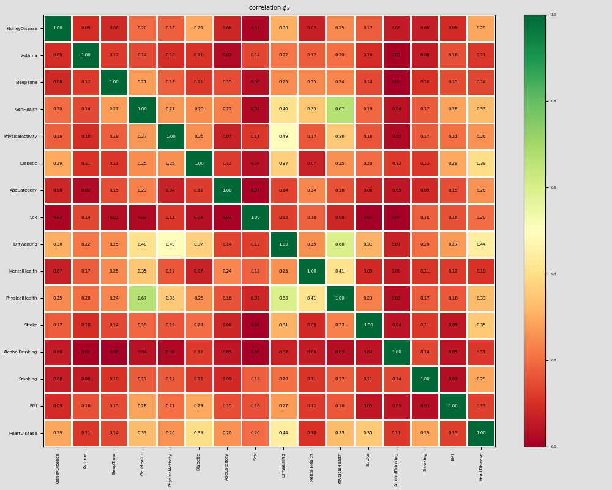
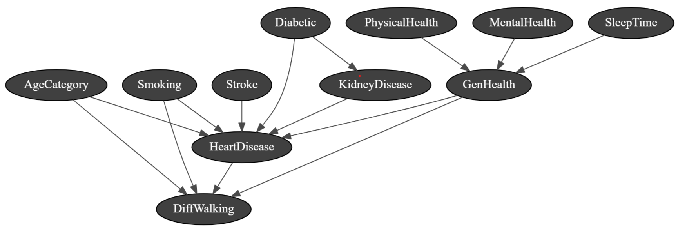

```{r setup, include=FALSE}
knitr::opts_chunk$set(echo = TRUE)
knitr::opts_chunk$set(fig.pos = 'H')
library(reticulate)
use_python("C:/Users/micha/AppData/Local/Programs/Python/Python39/python.exe")
```

```{python include=FALSE}
import gnb as gnb
import matplotlib.pyplot as plt
import pandas as pd
import numpy as np
from collections import Counter
from sklearn.model_selection import train_test_split
from sklearn.preprocessing import StandardScaler
import pyAgrum as gum
import pyAgrum.lib.notebook as gnb
from sklearn.metrics import accuracy_score
import pyAgrum.skbn as skbn
import matplotlib.pyplot as plt
import seaborn as sns
import phik
from phik.report import plot_correlation_matrix
from phik import report

data = pd.read_csv('heart_2020_cleaned.csv')
data.head
```

# Introudction 

Cardiovascular Disease (CVD) is the second leading cause of death in South Africa after HIV/AIDS [1]. Globally, CVD kills over 17.3 million people every year [2]. Nearly, half of all South Africans have at least 1 in 3 key risk factors for heart disease: High blood pressure, high cholesterol and smoking. Other key risk factors include diabetic status, lack of physical activity and excessive alcohol intake.

In South Africa access to health care is often limited particularly in low income and rural areas [3]. This, unequal access to health care was exacerbated during the recent Corona Virus Pandemic. Access, to health assessments is often limited or not feasible. However, 74.1% of South Africans have access to the internet. Therefore, it is important to be able to assess the risk of CVD and other health complications via a simple self reported *Personal Key Health Indicators* that can easily be done online. With the following shortfalls and opportunities in mind we identify the following objective:

- To create a tool that allows people to assess there risk of CVD and offer medical and health insights to mitigate the risk. 

The potential users of our app include South Africans with limited access to health care who otherwise would not be able to gain health and lifestyle insights regarding their personal heart health and well being. 


# Problem Analysis:

We are evaluating data from the 2020 annual CDC survey of over 400k adults related to their health status in order to model and predict the risk of heart disease. The dataset consists of 18 self reported variables: 

Variable          Description
----------        -----------
HeartDisease      Respondents that have ever reported having coronary heart disease (CHD) or 
                  myocardial infarction (MI)
BMI               Body Mass Index (BMI)
Smoking           Respondents that have smoked more than 100 cigarettes in their lifetime
AlcoholDrinking   Heavy drinkers (adult men having more than 14 drinks per week and adult women 
                  having more than 7 drinks per week)
Stroke            Respondents that have had a stoke.
PhysicalHealth    Days in the past month where the respondent rated their physical health as poor
MentalHealth      Days in the past month where the respondent rated their mental health as poor
DiffWalking       Does the respondent have difficulty walking or climbing stairs
Sex               Male or Female
AgeCategory       Fourteen-level age category
Race              Imputed race/ethnicity value
Diabetic          Respondents that have diabetes
PhysicalActivity  Respondents who reported doing physical activity or exercise during the past 30 
                  days other than their regular job
GenHealth         How the respondents rate their general health
SleepTime         How many hours on average does a respondent sleep in a day
Asthma            Respondents that have asthma
KidneyDisease     Respondents that have kidney disease (excluding kidney stones, urinary 
                  incontinence and bladder infections)
SkinCancer        Respondents that have/had skin cancer


The response variable is heart disease and the other 17 variables are explanatory variables of which 13 are categorical and 4 are continuous. In order to build our Bayesian Network Model we first conduct an Experimental Data Analysis to try and empirically determine causality after which we will consult expert sources to determine the veracity of our findings. 

## Experimental Data Analysis

Figure 1 shows the countplot of all binary categorical variables in the data set. From the countplots there appears to be a higher prevalence of heart disease in Male than female respondents, respondents who don't engage in physical activity, respondents who are smokers, respondents who have had a stroke, respondents who have/had kidney disease as well as respondents who have difficulty walking. 

```{python echo=FALSE, fig.cap="Count Plots of Binary Categorical Variables"}
plt.rcParams.update({'font.size': 4})
catagoricalVariables = ['Sex', 'Smoking', 'KidneyDisease', 'AlcoholDrinking', 'Stroke', 'DiffWalking', 'PhysicalActivity', 'Asthma', 'SkinCancer']
fig, ax = plt.subplots(3, 3)
fig.tight_layout(h_pad=2, w_pad=4, pad=3)
x = 0
y = 0
for i in catagoricalVariables:
    sns.countplot(x= data[i], hue = 'HeartDisease', data = data, ax=ax[x, y])
    ax[x, y].set_xlabel(i)
    ax[x, y].legend(['No Heart Disease', 'Heart Disease'])
    ax[x, y].set_ylabel('Frequency')
    #ax[x, y].set_title(i)
    x += 1
    if (x == 3):
        y += 1
        x = 0
plt.show()
fig.savefig("BinaryVar.png")
```

Figure 2 shows the countplots for the non-binary categorical variables. There appears to be an obvious increase in the prevalence of Heart Disease as the age of respondents increases. There also appears to be a higher prevalence of Heart Disease among respondents with diabetes. Finally, there is a less clear relationship between heart disease and self reported poor health. 

```{python echo=FALSE, fig.cap= "Count plots of other categorical variables"}
plt.rcParams.update({'font.size': 4})
catagoricalVariables = ['AgeCategory', 'Race', 'Diabetic', 'GenHealth']
fig, ax = plt.subplots(2, 2)
fig.tight_layout(h_pad=2, w_pad=4, pad=3)
x = 0
y = 0
for i in catagoricalVariables:
    if (i == 'AgeCategory'):
        order = ["18-24", "25-29", "30-34", "35-39", "40-44", "45-49", "50-54", "55-59", "60-64", "65-69", "70-74", "75-79", "80 or older"]
        sns.countplot(x= data[i], hue = 'HeartDisease', data = data, ax=ax[x, y], order = order)
    elif (i == "GenHealth"):
      order = ["Poor", "Fair", "Good", "Very good", "Excellent"]
      sns.countplot(x= data[i], hue = 'HeartDisease', data = data, ax=ax[x, y], order = order)
    else:
        sns.countplot(x= data[i], hue = 'HeartDisease', data = data, ax=ax[x, y])
    ax[x, y].set_xlabel(i)
    ax[x, y].legend(['No Heart Disease', 'Heart Disease'])
    ax[x, y].set_ylabel('Frequency')
    #ax[x, y].set_title(i)
    x += 1
    if (x == 2):
        y += 1
        x = 0
plt.show()
```

Figure 3 shows the empirical distributions of Heart Disease against the 4 continuous variables in the data set. There appears to be an increased prevalence of heart disease as BMI increases. 

Figure 4 shows a correlation plot between all the variables. Although there are few highly correlated variables the variables: DiffWalking, Stroke, Diabetic, AgeCategory, Kidney Disease, Physical Health, General Health have a weak to moderate correlation to Heart Disease. DiffWalking also appears to be correlated with GenHealth, PhysicalActivity, Diabetic, AgeCategory and PhysicalHealth. Diabetic also appears to be correlated with PhyscicalActivity, AgeCategory, DiffWalking and BMI. AgeCategory also appears to be correlated with SkinCancer and DiffWalking. PhyscialHealth appears to be correlated with GenHealth, PhysicalActivity and MentalHealth. Finally, GeneralHealth, is correlated with SleepTime, Diabtetic and DiffWalking. 


Given the above analysis the nodes we choose to use in our network are: PhysicalHealth, SleepTime, MentalHealth, Diabetic, GenHealth, Smoking, KidneyDisease, Stroke, AgeCategory, DiffWalking, BMI and Heart Disease. At this stage causality is unknown and expert resources will be used to determine conditional probabilities and causalities within the network. 

```{python echo=FALSE, fig.cap="Empirical Density of Categorical Variables", fig.si}
plt.rcParams.update({'font.size': 4})
HeartDisease = data.loc[data['HeartDisease'] == "Yes"]
NoHeartDisease = data.loc[data["HeartDisease"] == "No"]
continousVariables = ['BMI', 'MentalHealth', 'PhysicalHealth', 'SleepTime']
fig, ax = plt.subplots(2, 2)
fig.tight_layout(h_pad=2, w_pad=4, pad=3)
x = 0
y = 0

for i in continousVariables:
    sns.kdeplot(ax=ax[x, y], data=data, x=i, hue='HeartDisease', fill=True)
    ax[x, y].set_xlabel(i + " with heart disease")
    ax[x, y].set_ylabel('Frequency')
    x += 1
    if (x == 2):
        y += 1
        x = 0
plt.show()
```

## Expert Sources

The CDC list the greatest risk factors for heart disease as: High blood pressure, high cholesterol, smoking, diabetic status, lack of physical activity and excessive alcohol intake. Four of these variables were in our data set(Smoking, PhysicalActivity, Diabetic and Alcohol). Our EDA found Alcohol to be non descrpitive and is excluded from the network. We make the assumption that Smoking causes HeartDisease. A 1989 US National Health Survey [4] found that HeartDisease is the most common cause of death among adults with diabetes. The same survey also found that the risk of Diabetes increases with age. Additionally, the risk increases as Age increases. This leads us to be believe that heart disease is conditional on both AgeCategory and Diabetic and that Diabetic is dependant on AgeCategory.   A 2002 study [5] found that the risk of HeartDisease decreases with all forms of exercise. Thus, we conclude that HeartDisease is conditional on PhysicalActivity. 


The highest correlation with HeartDisease is DiffWalking. Research leads us to believe that in general heart disease is associate with an increased DiffWalking. Thus, we conclude that DiffWalking is conditional on HeartDisease. Additionally, it has been shown that there is a decreased walking speed and ability to complete complex walking tasks as age increase. Thus, DiffWalking is dependent on age [6]. It has also been shown that smoking affects walking speed as well as other forms of cardiovascular exercise [10]. Thus, DiffWalking is dependant on smoking. 



A 2004 study [7] found that the risk of coronary heart disease is high among patients with chronic kidney disease. They believed that this was because patients with chronic kidney disease need their hearts to pump harder to get blood to the kidneys. Thus, we conclude that HeartDisease is dependent on KindeyDisease. Additionally, it has been shown that Diabetes accounts for 40-50% of end stage renal disease (ESRD) [8]. Thus, we conclude that KidneyDisease is dependent on Diabtetic. 

A study investigating the long term causes of death of stroke patients found that the excess mortality rate of stroke patients was mainly due to cardiovascular disease [9]. Thus, we conclude that heart disease is dependent on stroke. 

Our EDA showed that HeartDisease was correlated with General Health. Using a common sense approach we conclude that HeartDisease is dependant on GeneralHealth. We conclude thar GeneralHealth is dependant on PhysicalHealth, SleepTime and MentalHealth. it has been shown that sleep time, mental health and physical health are vital determinants of health status [11][12][13]. 


# Network Model

## Bayesian Network

Following the the EDA and consultation of expert sources the Bayesian Network shown in Figure 5 was chosen. In order to calculate the weights of the network we split the dataset into Training and Validation sets and calculated the empirical probability distributions from the training set for the given structure. The performance of the our designed Bayesian Network will be compared to a learned Naive Bayes Network where HeartDisease is conditionally dependent on every other variable. 



## Decision Network


### References

1) https://www.heartfoundation.co.za/wp-content/uploads/2017/10/CVD-Stats-Reference-Document-2016-FOR-MEDIA-1.pdf
2) World Health Organization. Global status report on noncommunicable diseases 2014. Geneva: WHO, 2014
3) https://www.opensaldru.uct.ac.za/handle/11090/613#:~:text=Access%20to%20health%20care%20is,even%20in%20remote%20rural%20areas.
4) https://citeseerx.ist.psu.edu/viewdoc/download?doi=10.1.1.601.2380&rep=rep1&type=pdf
5)
6) https://www.ncbi.nlm.nih.gov/pmc/articles/PMC2645671/
7) https://www.acpjournals.org/doi/full/10.7326/0003-4819-140-1-200401060-00006?casa_token=qf1s1RyEvjcAAAAA%3AB92xeailLj-o4t6h9DtfPUl5bYi6-zmihBaBJOn4LGjzEjXsLks0lrDD58wa6a6_7kIUNBZ1rJEjRJOE
8) https://diabetesjournals.org/care/article/28/7/1813/27976/Screening-for-Kidney-Disease-in-Adults-With
9) https://www.ahajournals.org/doi/full/10.1161/hs0901.094253
10) https://link.springer.com/article/10.1007/s11357-015-9830-9
11) https://academic.oup.com/sleep/article/35/6/727/2709360
12) https://www.sciencedirect.com/science/article/pii/S0140673607612380?casa_token=-Dqsh7I-NpkAAAAA:_SriAr8KZ2xRngFYDpuiyHVXMfWxz3hlB8J8JbJgmQ3OyR_0zthYKv5HrN-Q7q9k_7tXONQrczW4
13) https://academic.oup.com/aje/article-abstract/93/5/328/172831